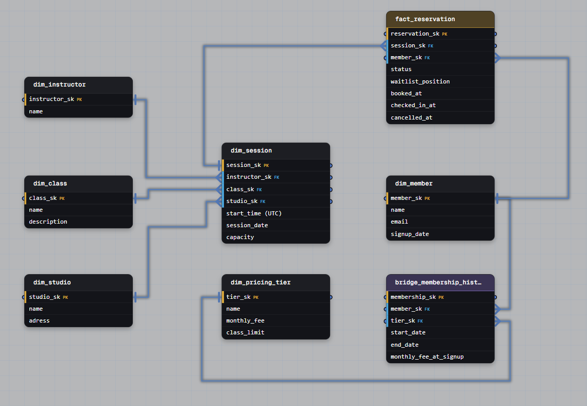

# Task 1: Fitness Studio Reservation Lifecycle (Bridge Table with State)

## Question

> Members sign up under a pricing tier that fixes their monthly fee and class allowance. Each session is a single dated occurrence of a class, held at one studio, at one time, with one instructor. Members reserve a spot; when a session fills, new bookings join a waitlist and get promoted when someone cancels. Members who show up are scanned at check-in, so a reservation that was never checked in stands apart as a no-show. How would you design a schema that supports memberships, the session calendar, and the full reservation lifecycle – where every booking is one of waitlisted, confirmed, cancelled, attended, or no-show?

## Schema

## Solution

This design uses `fact_reservation` as a **bridge table with state**, not just a plain junction table – it resolves the many-to-many relationship between `dim_member` and `dim_session`, but also carries the full lifecycle of that relationship as it evolves over time.

- `dim_class` and `dim_session` are split apart: `dim_class` is the catalog entry (yoga, spinning), `dim_session` is a single dated, timed occurrence tied to one studio and one instructor. This is what makes the calendar queryable independently of the class catalog.
- `fact_reservation` is the bridge between `dim_member` and `dim_session`. Neither `session_sk` nor `member_sk` is unique on its own – a session holds many reservations (up to capacity), and a member holds many reservations over time. The relationship itself is what's unique: one active reservation per (member, session) pair.
- The bridge doesn't just link two keys – it carries **state that changes over the life of the booking**: `status` (waitlisted → confirmed → attended / no-show / cancelled), `waitlist_position` for ordering promotion, and timestamps (`booked_at`, `checked_in_at`, `cancelled_at`) that pin down exactly when each transition happened.
- `fact_membership_history` is a second, independent bridge – this one between `dim_member` and `dim_pricing_tier` – using `start_date`/`end_date` to implement SCD Type 2 on the membership relationship itself, separate from the reservation lifecycle entirely.

## Why a bridge table, specifically (not a plain FK on the fact table)

The naive answer to "members book sessions" is "put `member_sk` and `session_sk` directly on a `fact_reservation` row and call it done." That's *almost* right – the difference that matters here is that the bridge isn't just resolving cardinality, it's **carrying a stateful relationship**, which changes the design in three ways:

1. **The relationship has a lifecycle, not just an existence.** A plain junction table answers "is member X linked to session Y?" – yes/no. This bridge has to answer "what *state* is that link in right now, and what states did it pass through?" That's why `status` and the timestamp columns live on the bridge row itself, not on either dimension.
2. **Promotion from waitlist has to be resolvable without touching history.** Because `waitlist_position` and `status` live on the bridge, promoting the next person just means updating their row in place – no need to delete and reinsert, no need to touch `dim_member` or `dim_session`. The bridge absorbs all the churn.
3. **Two independent relationships need two independent bridges.** Membership tier changes (tracked in `fact_membership_history`) and reservation status changes (tracked in `fact_reservation`) happen on completely different timelines and different grains. Collapsing them into one table – say, storing `tier_sk` directly on `fact_reservation` – would tie tier history to booking history for no reason, and make it impossible to ask "what tier was this member on in March" independent of whether they booked anything that month.

## Per-attribute framing (the strong-hire answer)

- **Reservation status → lives on the bridge (`fact_reservation`)**: it's the state of the *relationship* between a member and a session, not an attribute of either one. It changes independently and needs its own timestamps.
- **Pricing tier → its own bridge (`fact_membership_history`), Type 2**: a member's tier changes over time and needs to be reconstructable at any point (e.g., "what was their monthly fee when they signed up"), same reasoning as the address-history bridge – don't force it to piggyback on `dim_member`.
- **Session capacity / instructor / studio → stay as plain FKs on `dim_session`**: these don't change after a session is scheduled, so there's no bridge or versioning needed – a session either has an instructor or it doesn't, and reassigning one just overwrites the FK (Type 1).

## Failure mode this pattern avoids

If `status` and `checked_in_at` were pushed onto `dim_member` or `dim_session` instead of the bridge (e.g., "a session has a `filled` flag" or "a member has a `current_booking_sk`"), you'd lose the ability to represent one member holding *multiple simultaneous states across different sessions* – waitlisted for one class, confirmed for another, a no-show on a third from last week. The bridge is what lets each relationship carry its own independent state without the dimensions themselves needing to fan out.
