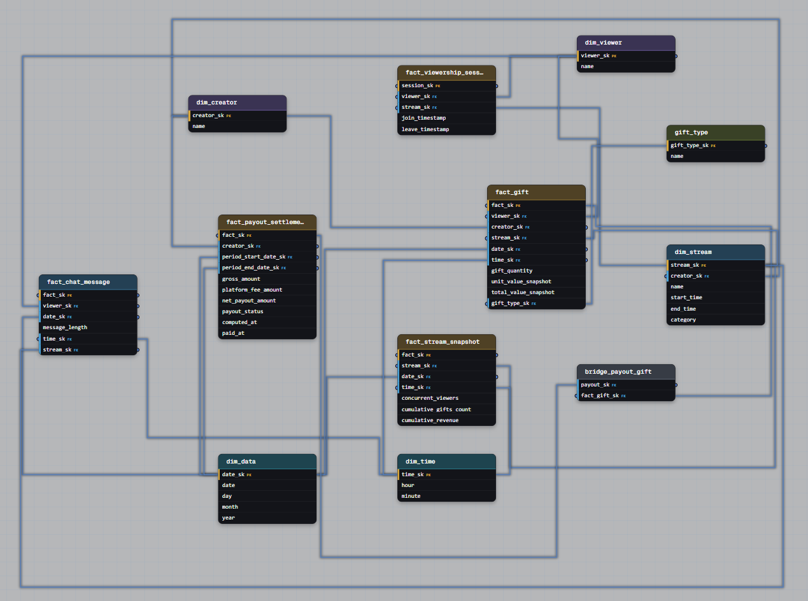

# Task 2: Livestream Co-Streaming Payout Split (Bridge Table with Weighted Allocation)

## Question

> We're building the analytics backend for a livestream platform. Creators go live, viewers watch and interact through chat and gifts. We need to track everything for creator payouts, content recommendations, and engagement analytics. Can you design the data model?
>
> Additional constraint: the platform supports **co-streaming** – a single stream can be hosted by multiple creators at once, and gift/payment revenue from that stream must be split between them according to an agreed percentage split (weights summing to 1). How does this change the schema, and where does the split logic live?

## Schema

**Dimensions**
- `dim_viewer` – viewer_sk, name
- `dim_creator` – creator_sk, name
- `dim_stream` – stream_sk, creator_sk, name, start_time, end_time, category
- `dim_date` – date_sk, date, day, month, year
- `dim_time` – time_sk, hour, minute
- `gift_type` – gift_type_sk, name

**Facts**
- `fact_viewership_session` – one row per viewer's single visit (join → leave) to one stream. Grain: (viewer_sk, stream_sk, join_timestamp). A viewer who leaves and rejoins produces a new row.
- `fact_gift` – one row per gift sent by one viewer, in one stream, at one moment. Immutable event; `unit_value_snapshot` and `total_value_snapshot` freeze the monetary value *as it was at send time*, independent of later catalog price changes.
- `fact_chat_message` – one row per chat message sent.
- `fact_stream_snapshot` – periodic snapshot, one row per stream per time bucket, carrying `concurrent_viewers`, `cumulative_gifts_count`, `cumulative_revenue`. This is where "live" aggregate numbers belong – never inside a session or gift row.
- `fact_payout_settlement` – one row per creator per settlement period (`period_start_date_sk` → `period_end_date_sk`), carrying `gross_amount`, `platform_fee_amount`, `net_payout_amount`, `payout_status`, `computed_at`, `paid_at`.

**Bridge**
- `bridge_payout_gift` – resolves the many-to-many between a settlement and the individual gifts it aggregates: one row per (payout_sk, fact_gift_sk). This is what makes a payout auditable – you can always answer "which exact gifts make up this payout" without re-running the aggregation logic, and it lets a gift be re-attributed to a *different* settlement period (e.g., a late-arriving gift, or a correction) without mutating `fact_gift` itself.

## Solution

**Why gifts and payouts are two separate facts, bridged together (not one fact with a running total)**

`fact_gift` is the immutable, granular event – it happens once, at one moment, and never changes after the fact. `fact_payout_settlement` is a *derived, periodic* fact – it aggregates many gifts over a settlement window (e.g., a week or a month) into one number a creator actually gets paid. Collapsing them into one row (a "stream generated $X so far") would violate the same grain rule that separated `fact_gift` from `fact_stream_snapshot`: a settlement is a `SUM(total_value_snapshot) GROUP BY creator, period`, not a raw measurement – so it belongs in its own fact, computed on its own cadence, with its own lifecycle (`payout_status`, `computed_at`, `paid_at`).

**Why the bridge, specifically, instead of just a `payout_sk` FK on `fact_gift`**

A plain FK would only let one gift belong to exactly one settlement, permanently, the moment it's written. The bridge exists because that link needs to be able to change after the fact – a gift can be reassigned to a later settlement period (disputed charge, late reconciliation, refund clawback) without rewriting the immutable gift row itself. The bridge absorbs that churn the same way `fact_reservation`'s `status` absorbs booking-state churn in Task 1: the *relationship* between a gift and a payout has its own lifecycle, separate from the gift event itself.

**Why `fact_gift` snapshots value instead of joining to a live price table**

If gift value were looked up from a current `gift_type` price at query time, every historical payout calculation would silently change whenever the platform updated prices – breaking reproducibility for already-paid-out periods. Snapshotting `unit_value_snapshot`/`total_value_snapshot` on the gift event itself means a payout computed today and recomputed a year from now (audit, dispute) always produces the same number.

**Why `fact_viewership_session` and `fact_gift`/`fact_chat_message` are three separate facts, not one generic "event" table**

Each has a different grain and different measures: a session has a duration (join/leave pair), a gift has a monetary value, a chat message has neither. Merging them would force nullable columns for whichever attributes don't apply to a given row and make it impossible to `SUM` or `COUNT` cleanly per event type – the same reasoning that separated payment from viewership earlier in this exercise.

**Where the "3000$ and 98 gifts so far" number lives**

Nowhere on `fact_viewership_session` or `fact_gift` – it's `fact_stream_snapshot`, a periodic snapshot keyed by (stream, time bucket), holding pre-aggregated running totals for dashboards/recommendations without re-scanning `fact_gift` on every read.–
