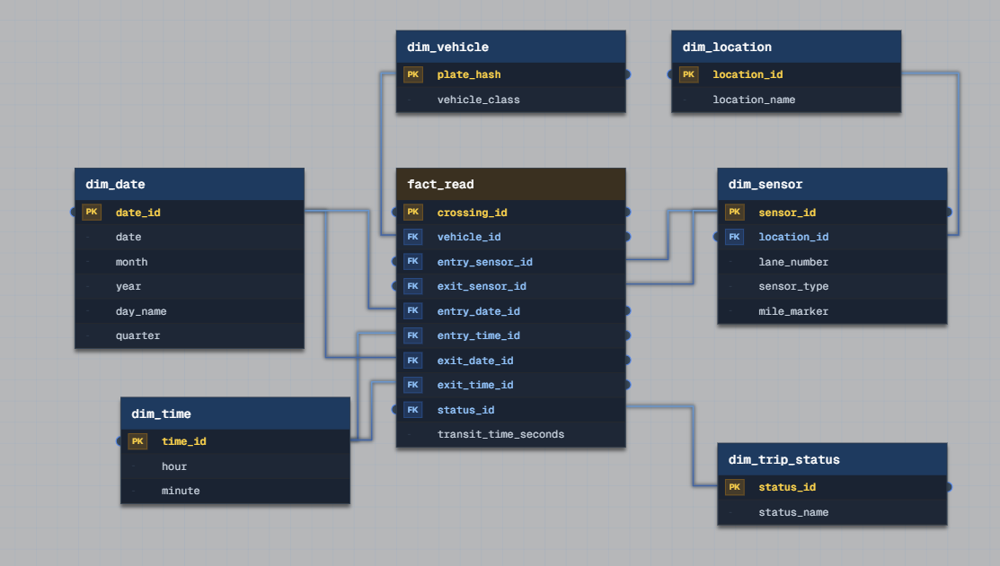

# Toll Road Network – Data Model

## Business Context

200 sensor-equipped lanes across 15 locations. Requirements:
- Real-time traffic volume
- Average transit time between checkpoints
- Toll evasion anomaly detection

## Grain Statement

**`fact_read`** – one row = one completed or in-progress vehicle crossing (a trip from an entry sensor to an exit sensor).

Unique on: `crossing_id`

This is an **accumulating snapshot fact table**: the row is inserted at entry time and updated in place when the matching exit read arrives. It is not a raw sensor-event log – it is the trip-level record.

## Why One Fact Table

Splitting raw sensor detections and trips into two separate fact tables would create two different grains: point-in-time events versus multi-sensor accumulated state. That ambiguity – which table drives analytics – is avoided by keeping a single fact table. **One fact table, one grain, one source of truth.**

## Schema



### Dimensions

| Table | Key | Purpose |
|---|---|---|
| `dim_vehicle` | `plate_hash` | Tokenized plate + vehicle class |
| `dim_location` | `location_id` | 15 physical network locations |
| `dim_sensor` | `sensor_id` | Lane, location, sensor type/role |
| `dim_date` | `date_id` | Calendar attributes |
| `dim_time` | `time_id` | Time-of-day attributes |
| `dim_trip_status` | `status_id` | OPEN / COMPLETED / STALE |

`dim_date` and `dim_time` are role-played twice (entry and exit) via separate FK columns on the fact table – this is intentional and is *not* a fan trap, since each role is a distinct, named foreign key.

### Fact: `fact_read`

```
crossing_id        PK

vehicle_id          FK -> dim_vehicle          NOT NULL
entry_sensor_id      FK -> dim_sensor           NOT NULL
entry_date_id        FK -> dim_date             NOT NULL
entry_time_id        FK -> dim_time             NOT NULL
exit_sensor_id       FK -> dim_sensor           NULLABLE
exit_date_id         FK -> dim_date             NULLABLE
exit_time_id          FK -> dim_time             NULLABLE
status_id            FK -> dim_trip_status      NOT NULL

transit_time_seconds                            NULLABLE
```

**Nullability is deliberate and load-bearing.** A row is created at entry with `status_id = OPEN` and all `exit_*` columns and `transit_time_seconds` set to `NULL`. It is updated in place when the matching exit read arrives.

This is what makes evasion detection possible without a join:

```sql
SELECT * FROM fact_read
WHERE status_id = 'OPEN'
  AND entry_time_id < now() - window;
```

If exit columns were `NOT NULL`, an incomplete trip – the case that actually matters for evasion detection – could never be written, and an `INNER JOIN` between separate entry/exit records would silently drop exactly those rows (a chasm trap).

## Query Patterns

| Requirement | How it's answered |
|---|---|
| Real-time traffic volume | Count `fact_read` rows by `entry_sensor_id` / `entry_date_id` / `entry_time_id`, regardless of `status_id` |
| Average transit time between checkpoints | `AVG(transit_time_seconds)` filtered to `status_id = 'COMPLETED'`, grouped by entry/exit location pair – a single aggregate query, no re-sessionization needed |
| Toll evasion anomaly detection | Rows with `status_id = 'OPEN'` past a timeout window |
