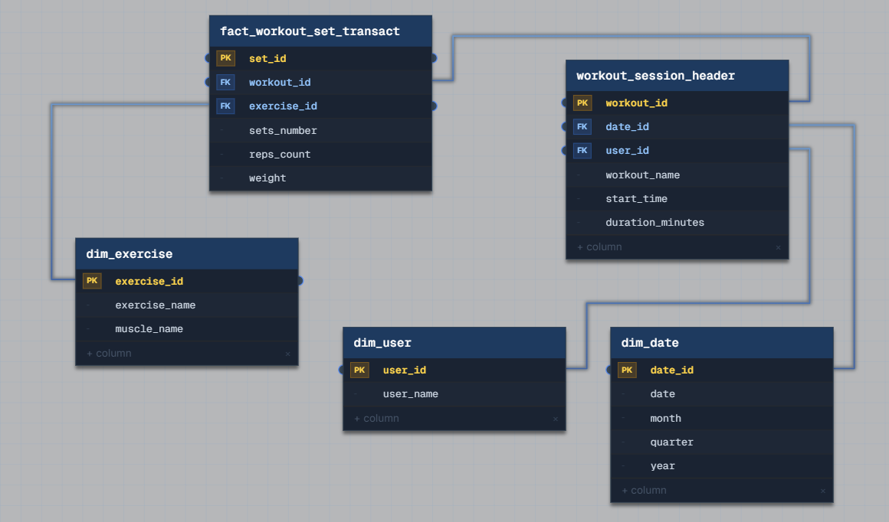

# Grain and Fan Traps

## Task 2: Fitness App Workout Tracking

We're building a fitness app where users log workouts. Each workout has exercises with sets and reps. We need to track progress over time, like "how much can this user bench press now vs. 3 months ago?" Design the data model.

## Problems

1. **"Workout" is ambiguous grain until split into two levels.** A workout session (one visit to the gym) and an individual set (one specific exercise performed for N reps at a given weight) are different units of analysis. Progress-over-time queries ("bench press now vs. 3 months ago") need the set-level grain, not the session-level grain – session-level would only tell you a workout happened, not what was lifted.
2. **Exercise must be a catalog dimension, not a free-text/denormalized value.** Comparing "the same exercise across different workouts and dates" only works if every set references a single, consistent `exercise_id` rather than a repeated exercise name string per row.
3. **Session-level metadata (date, user, duration) shouldn't be repeated on every set row.** A workout session has its own attributes (who, when, how long) that apply to all sets within it – storing them per set would duplicate data across every set of the same session and risk inconsistency if they ever diverged.

## Solution



### Dimensions

| Table | Key | Purpose |
|---|---|---|
| `dim_user` | user_id | app user |
| `dim_date` | date_id | standard date dimension (date, month, quarter, year) |
| `dim_exercise` | exercise_id | exercise catalog (name, muscle group) |

### Facts

**`workout_session_header`** – **transactional fact table** (session grain)
```
Grain: one row = one logged workout session
workout_id (PK), date_id (FK), user_id (FK),
workout_name, start_time, duration_minutes
```
Solves problem 3: session-level attributes (who, when, how long) live here once per session, instead of being repeated on every set. `duration_minutes` is the genuine measure at this grain.

**`fact_workout_set_transact`** – **transactional fact table** (set grain)
```
Grain: one row = one set of one exercise within one workout
set_id (PK), workout_id (FK → workout_session_header), exercise_id (FK → dim_exercise),
sets_number, reps_count, weight
```
Solves problem 1/2: this is the grain progress-tracking queries actually need – filtering by `exercise_id` + `user_id` (via `workout_id` → `workout_session_header` → `user_id`) + `date_id` lets you compare `weight` for the same exercise across time directly, e.g. "max weight for bench press this week vs. 12 weeks ago."
