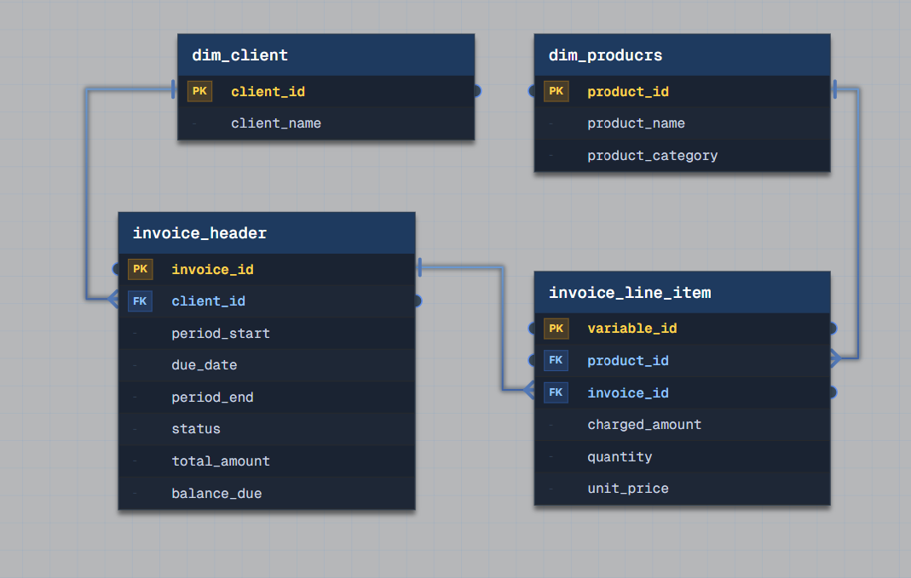

# Grain and Fan Traps

## Task 3: B2B SaaS Monthly Billing

We run a B2B SaaS platform that bills customers monthly. Each invoice pairs a header carrying the billing period and running status with a variable set of charges for subscription tiers, usage overages, and one-time fees, where every charge locks in the price that was in effect when the bill was issued. Finance needs to see what each customer still owes as invoices age past their due date.

## Problems

1. **Header-grain and line-item-grain questions must not be answered from the same joined result.** "What does this customer owe" is invoice grain (one row per invoice, `total_amount`/`balance_due` already computed). "What was billed for a specific product/charge type" is line-item grain (one row per charge). Joining `invoice_header` to `invoice_line_item` and then aggregating a header-level column (e.g. `SUM(total_amount)`) over the joined result double-counts it – the header's `total_amount` gets repeated once per line item and inflates by a factor of N (N = number of line items on that invoice). This is a 1:N denormalization issue, not a fan trap: there is only one branching relationship here, not two independent one-to-many branches from a shared parent.
2. **`unit_price` must be a snapshot on the line item, not derived from `dim_products` at query time.** Products' prices change over time; if a line item's charge were recomputed from the current `dim_products.unit_price` instead of being stored at billing time, historical invoices would silently reflect today's price instead of the price actually billed – corrupting AR aging and the audit trail.

## Solution



### Dimensions

| Table | Key | Purpose |
|---|---|---|
| `dim_client` | client_id | customer reference |
| `dim_products` | product_id | subscription tiers, usage types, one-time fee catalog |

### Facts

**`invoice_header`** – **transactional fact table** (invoice grain)
```
Grain: one row = one invoice
invoice_id (PK), client_id (FK),
period_start, period_end, due_date, status, total_amount, balance_due
```
Carries the AR aging attributes finance needs: `due_date`, `status`, `balance_due`. `total_amount` is the genuine measure at this grain – computed once when the invoice is issued, not re-derived by joining to line items each time (problem 1).

**`invoice_line_item`** – **transactional fact table** (charge grain)
```
Grain: one row = one charge on one invoice
variable_id (PK), invoice_id (FK), product_id (FK),
quantity, unit_price, charged_amount
```
`unit_price` is locked in at billing time (problem 2) – never re-derived from `dim_products`, so a later price change on the product catalog can't alter what a past invoice says it charged. `charged_amount` is the per-line measure (`quantity × unit_price`, possibly overridden for overages/one-time fees).

### Modeling approach: keep each grain self-sufficient, don't cross-aggregate

The header/line-item split (see also Task 2's `workout_session_header` pattern) means each grain answers its own question directly, without needing a join to the other table:

- **AR aging ("what does each customer owe")** – read `invoice_header` alone. `balance_due` is already correct at invoice grain; no join to `invoice_line_item` is needed or should be performed for this question.
- **Line-item analysis ("total usage-overage revenue this month")** – aggregate `invoice_line_item` to whatever grain is needed (e.g. `GROUP BY product_id`) *before* joining back to `invoice_header` or `dim_client`, so a header-level column is never summed alongside a line-item-level column in the same un-aggregated join.

The general rule: when a "1" side carries its own stored total and the "N" side carries the components of that total, aggregate the "N" side to the "1" side's grain first if you ever need to combine them – never join them raw and then sum a column that belongs to the "1" side.
