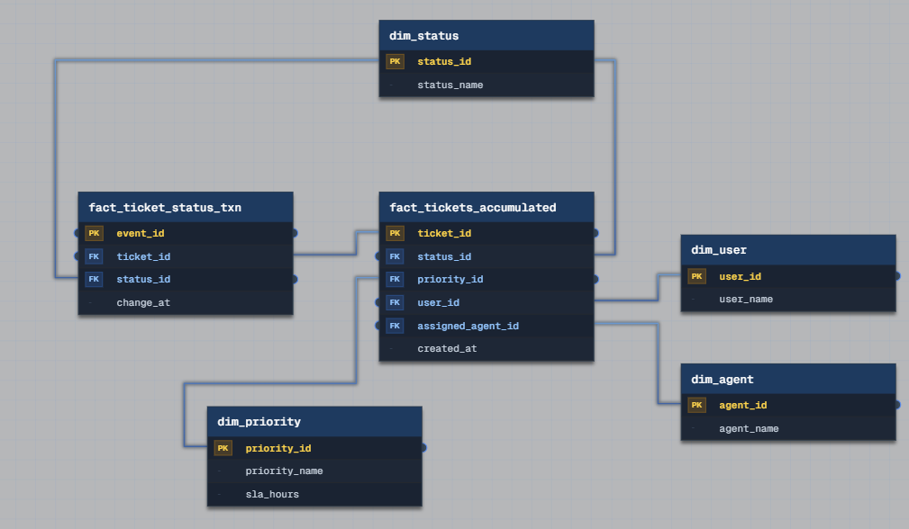

# Grain and Fan Traps

## Task 4: IT Helpdesk Platform

We run an IT helpdesk platform. Users submit support tickets, which are assigned to agents. Tickets go through multiple status changes before being resolved. SLA compliance is critical: P1 tickets must be resolved within 4 hours, P2 within 24 hours. Design the schema, and describe how you would load data from a JSON API feed into it.

## Problems

1. **"Ticket" hides two different grains: current state vs. full history.** A ticket has one current status at any moment, but SLA compliance and audit require knowing every status it passed through and exactly when. Storing only the current status (overwriting it on each change) destroys the history needed to validate SLA transitions after the fact.
2. **SLA compliance can't be computed from current status alone.** To check whether a P1 ticket was resolved within 4 hours, you need the timestamp of when it *entered* its initial state and the timestamp of when it *reached* resolved – both require a timestamped log of transitions, not a single "current status" field.
3. **SLA thresholds must live in a dimension, not be hardcoded per query.** "P1 = 4 hours, P2 = 24 hours" is a business rule tied to priority, and it changes over time (e.g. contract renegotiation). Embedding the hour thresholds directly in SQL logic means every query needs updating when the rule changes; keeping it as a dimension attribute means only one row needs updating.

## Solution



### Dimensions

| Table | Key | Purpose |
|---|---|---|
| `dim_status` | status_id | ticket status catalog (Open, In Progress, Resolved, etc.) |
| `dim_priority` | priority_id | priority catalog, carries `sla_hours` – the SLA threshold rule (problem 3) |
| `dim_user` | user_id | ticket submitter |
| `dim_agent` | agent_id | support agent |

### Facts

**`fact_tickets_accumulated`** – **accumulating snapshot fact table**
```
Grain: one row = one ticket, reflecting its current state
ticket_id (PK), status_id (FK), priority_id (FK), user_id (FK),
assigned_agent_id (FK), created_at
```
Row is created when the ticket is submitted and updated in place (`status_id`, `assigned_agent_id`) as the ticket moves through its lifecycle – same pattern as the accumulating snapshot fact from Task 1. This table always answers "what is this ticket's state right now" without scanning history.

**`fact_ticket_status_txn`** – **transactional fact table** (append-only event log)
```
Grain: one row = one status change event for one ticket
event_id (PK), ticket_id (FK), status_id (FK), change_at
```
Solves problem 1/2: every transition is preserved as its own immutable row, never updated or deleted. SLA compliance is computed from this log – find the timestamp the ticket entered its tracked state and the timestamp it reached `Resolved`, take the difference, and compare it to `dim_priority.sla_hours` for that ticket's priority.

## Loading from a JSON API Feed

Assume the feed delivers one JSON payload per ticket update (either polled periodically or pushed as a webhook), containing at minimum: `ticket_id`, `status`, `priority`, `user_id`, `agent_id`, and an event timestamp.

1. **Resolve dimension keys.** Look up (or seed, since these are small, slow-changing reference sets) `status_id`, `priority_id`, `user_id`, `agent_id` from the incoming string/external values against `dim_status`, `dim_priority`, `dim_user`, `dim_agent`.
2. **Check whether this is a new ticket or an existing one.** Look up `ticket_id` in `fact_tickets_accumulated`.
   - If not found: insert a new row into `fact_tickets_accumulated` (`created_at` = event timestamp, initial `status_id`), and insert the corresponding first event into `fact_ticket_status_txn`.
   - If found: compare the incoming `status_id` to the value currently stored in `fact_tickets_accumulated`.
3. **On a status change:** append a new row to `fact_ticket_status_txn` (never update or delete an existing event row – this table is append-only by design, since it's the audit trail), then update `fact_tickets_accumulated.status_id` (and `assigned_agent_id`, if reassigned) in place to reflect the new current state.
4. **On no status change** (e.g. the feed re-delivers the same state, or only non-status fields changed): skip writing to `fact_ticket_status_txn` to avoid polluting the event log with duplicate transitions; update `fact_tickets_accumulated` only if a non-status attribute (like `assigned_agent_id`) changed.
5. **SLA check runs as a downstream query/job** over `fact_ticket_status_txn` joined to `dim_priority` – not during ingestion – comparing the gap between the ticket's start event and its `Resolved` event against `sla_hours`, so ingestion stays a simple append/update process and SLA logic stays centralized in one place.
