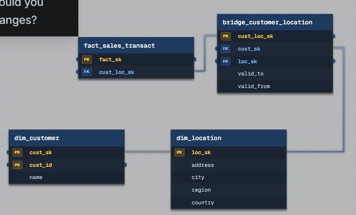

Task 1 customer address history · MD
# Task 1: Customer Address History (SCD Type 2 with Bridge Table)
 
## Question
 
> Our customer support team needs to see a customer's **current address** and their **full address history** for regional sales analysis. How would you design a schema that handles address changes?
 
## Schema
 

 
 
## Solution
 
This design implements an SCD Type 2 pattern with temporal tracking, but it puts the versioning **on the relationship**, not on the customer row itself.
 
- `bridge_customer_location` uses `valid_from` / `valid_to` date ranges to implement SCD Type 2 logic: `WHERE valid_to IS NULL` gives the current address, dropping the filter gives full history.
- Address is modeled as its **own dimension** (`dim_location`), separate from `dim_customer`, with the bridge table serving as the relationship carrier that holds the temporal grain of *when* each customer was at each address.
- Keys are placed so the bridge table is the **central hub**: it connects `dim_customer` to `dim_location`, and `fact_sales_transact` references the bridge's `cust_loc_sk` alone – there's no separate `cust_sk` FK on the fact table, because the bridge row already resolves both the customer and the address for that point in time.
- Grain is clean at every level: `dim_location` = one unique physical address, `dim_customer` = one unique customer, `bridge_customer_location` = one customer–address relationship valid for a specific time window, `fact_sales_transact` = one transaction, correctly pinned to the customer-location pairing that was in effect *at the time of the transaction*.
## Why a bridge table, specifically (not classic SCD2 on `dim_customer`)
 
The textbook answer to "track address history" is "just do Type 2 on the customer dimension: add `valid_from`/`valid_to` to `dim_customer` and insert a new row per address change." That answer is wrong here, for three concrete reasons – and naming them is what turns this into a strong-hire answer:
 
1. **Address is a shared, reusable entity – not an attribute.** Multiple customers can live at the same physical address (a corporate HQ, a shared household, a franchise location). If you version the whole customer row every time an address changes, you duplicate the address string across every customer row that happens to share it, and you lose the ability to ask "which customers are at this address" without string-matching. A separate `dim_location` with its own surrogate key lets the address exist once and be referenced many times.
2. **Decoupling avoids row-explosion.** If `dim_customer` carries `name`, `email`, `tier`, `region`, etc., and you Type-2 the *entire row* every time any one attribute changes, you get the "Type 2 on everything" problem: an address change forces a full customer-row insert, a name change forces a full customer-row insert, and the dimension grows one row per change across *all* attributes combined. Splitting address into its own dimension + bridge means address history versions independently – you're not paying the storage cost of re-stating `name` and `tier` every time someone moves.
3. **The relationship itself can be many-to-many, not strictly sequential.** A pure Type-2 `dim_customer` assumes one "current" state per customer at any instant. But a customer might legitimately have concurrent addresses (billing vs. shipping, or multiple regional offices for a B2B account). A bridge table with `valid_from`/`valid_to` naturally supports overlapping or parallel address relationships, which a single versioned dimension row cannot.
The fact table referencing **only** `cust_loc_sk` – with no separate `cust_sk` FK – is the detail that makes the regional analysis actually work and keeps the model from carrying a redundant key. Since `bridge_customer_location` already ties `cust_sk` to `loc_sk` for a specific window, a single `cust_loc_sk` on the fact table snapshots *which* customer–address version was in effect at transaction time. To get the customer, you join fact –> bridge –> `dim_customer`; to get the address, fact –> bridge –> `dim_location`. Historical revenue-by-region queries don't need a date-range join at query time at all – the point-in-time resolution is already baked into the fact row via the bridge key.
 
## Per-attribute framing (the strong-hire answer)
 
- **Address –> Type 2** (via bridge table): regional sales analysis requires point-in-time accuracy; getting this wrong silently misattributes revenue when a customer relocates.
- **Name –> Type 1**: nobody reports sales "by the customer's name as it was in Q2." Overwrite in place.
- **Customer tier / segment –> depends on the follow-up**: if finance needs to know what tier a customer was in when a discount was applied, that's Type 2 too – on its own bridge or its own versioned sub-dimension, for the same reason as address: don't force it to piggyback on the customer's full row.
## Failure mode this pattern avoids
 
Treating address like a plain Type 1 overwrite (as some real systems have) means a disputed transaction or a regional-performance report can never be reconstructed accurately after the fact – the historical "where were they when this happened" question becomes unanswerable once the address is overwritten.
 
